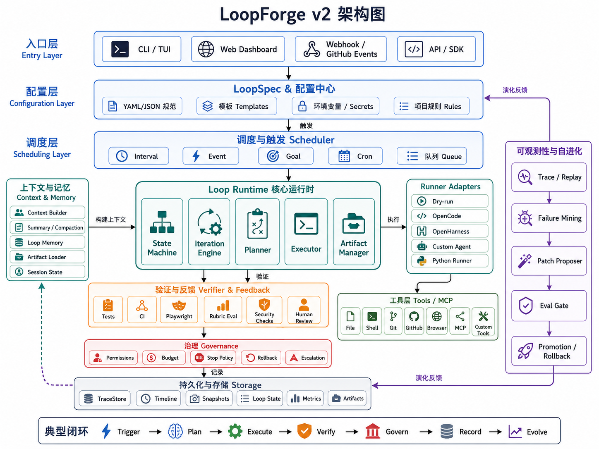

# LoopForge

[中文](README.md) | [English](README.en.md)

LoopForge 是一个用于设计、运行、观测和进化 AI Agent Loops 的开源 runtime。

Prompt Engineering 关注“如何让模型这一次回答得更好”。Loop Engineering 关注的是另一件事：如何把目标、上下文、工具、反馈、验证、停止、回滚和演化组织成一个可长期运行、可审计、可中断的系统。

## 架构图



## 核心定位

LoopForge 不是“定时任务版 AutoGPT”，也不是简单地让 Agent 每隔几分钟重复同一个 prompt。

它把一个 loop 定义为：

```text
Goal + Context + Agent + Tools + Feedback + Verifier + Stop Policy + Rollback + Trace
```

也就是说，一个好的 loop 不只是会继续执行，还必须知道：

- 什么时候继续
- 什么时候停止
- 什么时候回滚
- 什么时候升级给人类
- 什么时候接受一次变更
- 什么时候从失败轨迹中改进 loop 本身

## 已实现能力

- 声明式 `LoopSpec` YAML
- `dry-run` / `custom` / `opencode` / `openharness` runner adapter
- 独立 verifier，避免 agent 自我验收
- stop policy 与 budget policy
- Git diff snapshot 与失败回滚入口
- JSONL trace timeline
- 持久化 loop state、progress、memory、artifacts
- CLI：初始化、运行、查看 loop
- 示例 PR CI fixer loop

## 快速开始

```bash
npm install
npm run build
npm run dev -- run examples/pr-ci-fixer.loop.yaml --once
```

示例会运行一个 dry-run loop，并把状态和轨迹写入：

```text
.loopforge/loops/pr-ci-fixer/
```

## CLI

```bash
loopforge init pr-ci-fixer
loopforge run loops/pr-ci-fixer.loop.yaml --once
loopforge list
loopforge inspect pr-ci-fixer
```

开发模式可以使用：

```bash
npm run dev -- run examples/pr-ci-fixer.loop.yaml --once
```

## LoopSpec 示例

```yaml
name: pr-ci-fixer
goal: >
  Keep the current pull request green. If CI fails, diagnose the failure,
  make the minimal fix, run the relevant tests, and accept only verified work.

trigger:
  type: interval
  every: 10m

runner:
  type: dry-run

context:
  include:
    - github_pr
    - changed_files
    - ci_logs
    - repo_instructions
    - previous_attempts
  max_tokens: 60000

budget:
  max_cost_usd: 3
  max_iterations: 8
  max_runtime: 2h
  min_interval: 5m
  stop_on_repeated_failure: 3

verifier:
  strategy: composite
  checks:
    - type: runner_exit_zero
    - type: diff_scope
      max_files_changed: 5
    - type: no_secret_access

stop:
  max_iterations: 8
  repeated_failure: 3
  no_progress: 3

rollback:
  strategy: git_worktree
  rollback_on_failed_verifier: true
  preserve_artifacts: true
```

## 项目结构

```text
src/
  agent/          runner adapter
  cli/            loopforge CLI
  context/        context builder
  core/           LoopSpec、runtime、state
  governance/     permissions、budget、stop、rollback
  io/             YAML、JSON、shell helpers
  scheduler/      trigger scheduler
  trace/          JSONL trace store
  verifier/       independent verifier
tests/            runtime tests
examples/         example LoopSpec files
docs/assets/      README assets
```

## 验证

```bash
npm run typecheck
npm run build
npm test
npm audit --audit-level=moderate
```

当前 MVP 的重点是把 Loop Engineering 的核心骨架跑通：声明式规格、循环执行、独立验证、停止策略、回滚入口和可追踪状态。后续可以继续扩展 Web Dashboard、GitHub webhook、Playwright verifier、failure mining、patch proposer 和 eval gate。
